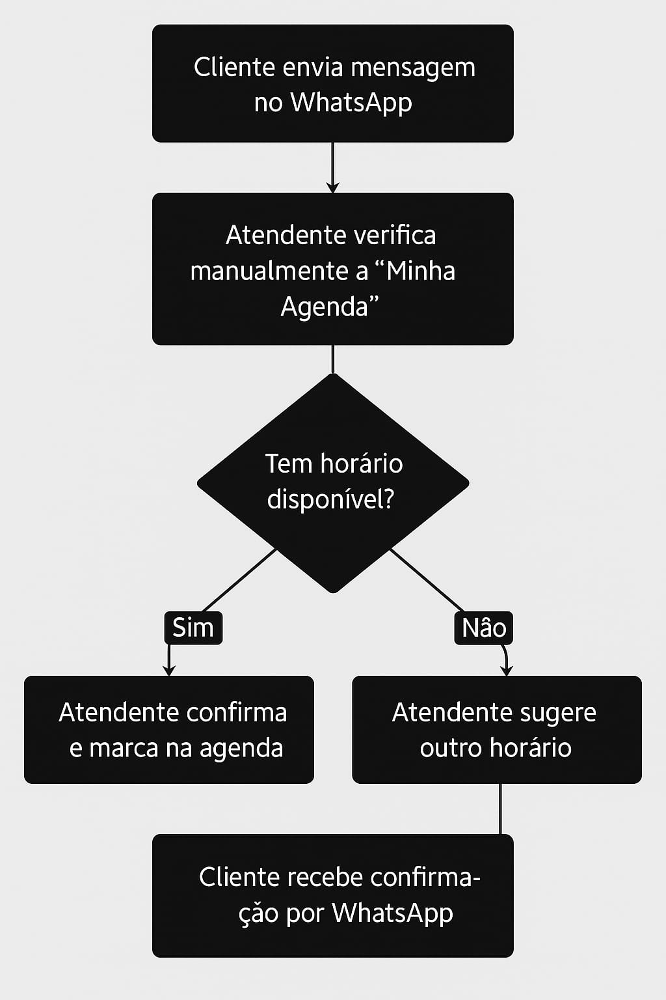

<h1 align="center"><b>Maxwell - Agendas 🗓️</b></h1>

## 1. Resumo e contexto da empresa escolhida

1.  **Apresentação da empresa:** Rd Brows, Clínica estética facial e corporal Feminina, micro/pequena empresa, localizada no sudoeste CLSW 101 Bloco b Loja 110/114.

2. **Cenário atual:** Ela opera presencialmente apenas na loja, oferece serviços de estética focado em micropigmentação,cuidados da pele, face, design e manicure/pedicure.

3. **Justificativa de escolha da empresa:** A empresa apresenta um problema na marcação de horário de sessão de atendimento, pois apesar de usarem um aplicativo dedicado de gestão de agenda de colaborador, toda marcação feita por whatsapp, telefone ou presencialmente, deve ser preenchida manualmente, assim levando a problemas como possível demora no atendimento, pois o atendente deve o tempo todo estar checando se chegou mensagem por whatsapp solicitando. 

## 2. Mapeamento do processo

- **Processo:** O cliente entra em contato com a empresa pelo whatsapp e solicita uma marcação no horário disponível na agenda para uma vasta gama de serviços estéticos oferecidos pela clínica. O responsável pelo atendimento consulta manualmente no aplicativo “Minha Agenda” a disponibilidade de horário e faz a marcação do horário do cliente se houver possibilidade,conforme demonstrado na *figura 1*.

    
    
Figura 1 - Fluxograma do processo de atendimento da empresa

    
Fonte: Os autores (2025)

- **Pontos de Dor/Problemas:**
    - Processo totalmente manual
    - Requer atenção do atendente em tempo integral para controlar o fluxo
    - Pode ocasionar perdas de clientela caso o atendente demore para responder
    - Lentidão na hora de consulta e marcação

## 3. Problema que a solução de TI visa resolver

&nbsp;&nbsp;&nbsp;&nbsp;&nbsp;&nbsp;&nbsp;A pessoa deve manualmente marcar horário no sistema (“Minha agenda”) quando o cliente solicitar por whatsapp, assim levando a lentidão no atendimento pois o atendente pode não estar disponível para fazer a administração do horário na mesma hora que o cliente entrar em contato. A desmarcação de horário vem a sofrer o mesmo problema, caso a pessoa queira cancelar.

## 4. Público-Alvo

- **Público alvo direto:** Atendente (Manuseia os horários e marca eles) - Cliente (Solicita a marcação de horário)

- **Público alvo indireto:** Esteticistas (Atendem os clientes baseados nos horários marcados pelo atendente)

## 5. O que a ideia faz

Realiza o registro do horário com X profissional de acordo com o que foi escolhido através da comunicação por chatbot através do numero do whatsapp.
1. Marcação de horário
2. Registro no sistema
3. Comunicação automatizada 
4. Exclusão de horário marcado

## 6. O que a ideia não faz

- **A solução não faz:**
    - Acompanhamento financeiro
    - Geração de notas fiscais
    - Meios de geração de pagamento pela plataforma
    - Interface para cliente na web

## 7. Principais Stakeholders

Desenvolvedores(Implementadores), Clientes (Beneficiários), Atendentes (Usuários diretos), Donos do negócio(Decisores), Profissional de estética da clínica (Beneficiários).
