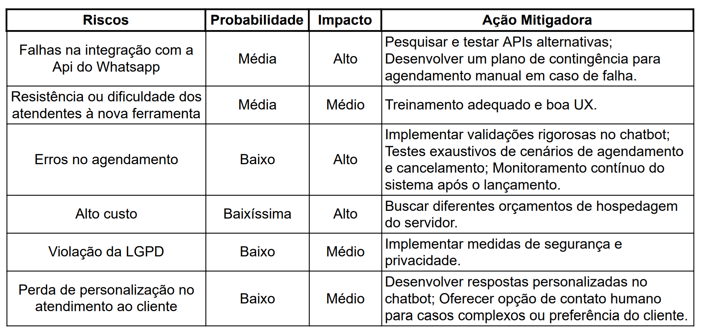
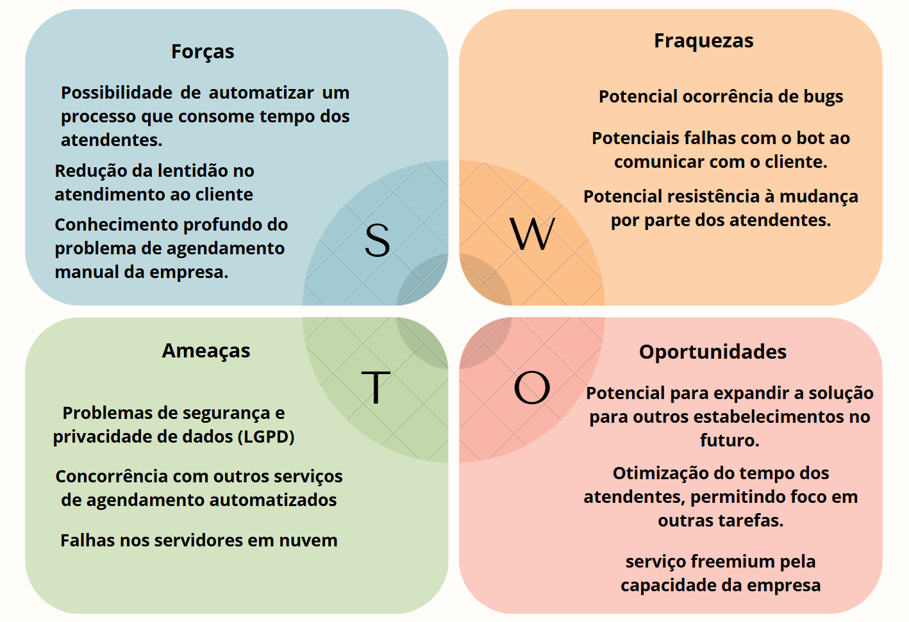

<h1 align="center"><b>Maxwell - Agendas 🗓️</b></h1>

## Índice

- [01. Resumo e contexto da empresa escolhida](#1-resumo-e-contexto-da-empresa-escolhida)
- [02. Mapeamento do processo](#2-mapeamento-do-processo)
- [03. Problema que a solução de TI visa resolver](#3-problema-que-a-solução-de-ti-visa-resolver)
- [04. Público-Alvo](#4-público-alvo)
- [05. O que a ideia faz](#5-o-que-a-ideia-faz)
- [06. O que a ideia não faz](#6-o-que-a-ideia-não-faz)
- [07. Principais Stakeholders](#7-principais-stakeholders)
- [08. Mapeamento de riscos do projeto](#8-mapeamento-de-riscos-do-projeto)
- [09. Matriz SWOT](#9-matriz-swot)
- [10. Business Model Canvas](#10-business-model-canvas)
- [11. Análise de mercado](#11-análise-de-mercado)
- [12. Funcionamento da solução de TI](#12-funcionamento-da-solução-de-ti)
- [13. Propriedade intelectual](#13-propriedade-intelectual)

----
## 1. Resumo e contexto da empresa escolhida

1.  **Apresentação da empresa:** Rd Brows, Clínica estética facial e corporal Feminina, micro/pequena empresa, localizada no sudoeste CLSW 101 Bloco b Loja 110/114.

2. **Cenário atual:** Ela opera presencialmente apenas na loja, oferece serviços de estética focado em micropigmentação,cuidados da pele, face, design e manicure/pedicure.

3. **Justificativa de escolha da empresa:** A empresa apresenta um problema na marcação de horário de sessão de atendimento, pois apesar de usarem um aplicativo dedicado de gestão de agenda de colaborador, toda marcação feita por whatsapp, telefone ou presencialmente, deve ser preenchida manualmente, assim levando a problemas como possível demora no atendimento, pois o atendente deve o tempo todo estar checando se chegou mensagem por whatsapp solicitando. 

## 2. Mapeamento do processo

- **Processo:** O cliente entra em contato com a empresa pelo whatsapp e solicita uma marcação no horário disponível na agenda para uma vasta gama de serviços estéticos oferecidos pela clínica. O responsável pelo atendimento consulta manualmente no aplicativo “Minha Agenda” a disponibilidade de horário e faz a marcação do horário do cliente se houver possibilidade,conforme demonstrado na *figura 1*.

    
    
Figura 1 - Fluxograma do processo de atendimento da empresa

    
Fonte: Os autores (2025)

- **Pontos de Dor/Problemas:**
    - Processo totalmente manual
    - Requer atenção do atendente em tempo integral para controlar o fluxo
    - Pode ocasionar perdas de clientela caso o atendente demore para responder
    - Lentidão na hora de consulta e marcação

## 3. Problema que a solução de TI visa resolver

&nbsp;&nbsp;&nbsp;&nbsp;&nbsp;&nbsp;&nbsp;A pessoa deve manualmente marcar horário no sistema (“Minha agenda”) quando o cliente solicitar por whatsapp, assim levando a lentidão no atendimento pois o atendente pode não estar disponível para fazer a administração do horário na mesma hora que o cliente entrar em contato. A desmarcação de horário vem a sofrer o mesmo problema, caso a pessoa queira cancelar.

## 4. Público-Alvo

- **Público alvo direto:** Atendente (Manuseia os horários e marca eles) - Cliente (Solicita a marcação de horário)

- **Público alvo indireto:** Esteticistas (Atendem os clientes baseados nos horários marcados pelo atendente)

## 5. O que a ideia faz

Realiza o registro do horário com X profissional de acordo com o que foi escolhido através da comunicação por chatbot através do numero do whatsapp.
1. Marcação de horário
2. Registro no sistema
3. Comunicação automatizada 
4. Exclusão de horário marcado

## 6. O que a ideia não faz

- **A solução não faz:**
    - Acompanhamento financeiro
    - Geração de notas fiscais
    - Meios de geração de pagamento pela plataforma
    - Interface para cliente na web

## 7. Principais Stakeholders

Desenvolvedores(Implementadores), Clientes (Beneficiários), Atendentes (Usuários diretos), Donos do negócio(Decisores), Profissional de estética da clínica (Beneficiários).

## 8. Mapeamento de riscos do projeto

&nbsp;&nbsp;&nbsp;&nbsp;&nbsp;&nbsp;&nbsp;Identificamos os principais riscos associados ao projeto Max-agendas que consiste em automatizar o atendimento por whatsapp através de chat-bot e integrá-lo com uma interface própria para controle de agendamentos da clínica estética ‘Rd Brows’. Após identificar esses riscos, iremos classificar sua probabilidade, impacto e possíveis ações mitigadoras.

    
    
Tabela 1 -  Mapeamento de riscos

    
Fonte: Os autores (2025)

## 9. Matriz SWOT

&emsp;&emsp; A análise SWOT é uma ferramenta de gestão utilizada para avaliar um projeto, produto ou empresa. Consiste em identificar e analisar os pontos fortes e fracos internos, assim como as oportunidades e ameaças presentes no ambiente externo. Essa análise permite ter uma visão clara do cenário atual, identificar os principais desafios e oportunidades e tomar decisões mais estratégicas para alcançar os objetivos desejados.

    
    
Figura 3 - Matriz SWOT

    
Fonte: Os autores (2025)

## 10. Business Model Canvas

&emsp;&emsp; O *Business Model Canvas* é uma ferramenta estratégica que auxilia na visualização, criação e análise de modelos de negócio de forma simples e estruturada. Ele é composto por nove blocos que representam os principais elementos de um negócio: proposta de valor, segmentos de clientes, canais, relacionamento com clientes, fontes de receita, recursos-chave, atividades-chave, parcerias-chave e estrutura de custos. Seu objetivo é ajudar empreendedores e empresas a entender, inovar ou melhorar a maneira como entregam valor aos clientes e geram receita.

    
    
Figura 4 - Business Model Canvas

    
Fonte: Os autores (2025)

## 11. Análise de mercado

1. Segmentação de clientes:
    - **Clientes principais:** Que possuem em média 3 a 5 clientes por dia, tendo o maior movimento perto dos finais de semana. Utiliza-se aplicativo pago e recurso humano para demandas de pequena movimentação.
    - **Clientes secundários:** Que necessitam implementação de chatbot com marcação de agenda na empresa.

2. Análise de concorrência:

    
    
Tabela 2 - Concorrentes diretos

    
Fonte: Os autores (2025)

3. Tendências de Mercado:

    
    
Tabela 3 - Concorrentes indiretos

    
Fonte: Os autores (2025)

## 12. Funcionamento da solução de TI

- **Funcionamento do processo para o profissional da clínica de estética:**
    1. Abre a plataforma Max Agenda.
    2. Identifica horários marcados no dia e filtrados pelo seu usuário.
    3. Atende o cliente no horário marcado.

- **Funcionamento do processo para o cliente:**
    1. Entra em contato por whatsapp da clínica solicitando atendimento.
    2. Chatbot responde demonstrando horários disponíveis com X profissional solicitado ou horários já marcados.
    3. Cliente marca ou desmarca horário.
    4. Chatbot se comunica com a plataforma max agenda e insere horário de atendimento do cliente Y com profissional X.
    5. O cliente é atendido no horário marcado.

- **Tecnologias usadas:**

    
    
Tabela 4 - Tecnologias usadas

    
Fonte: Os autores (2025)

- **Diferenciais:** Processo automatizado por chatbot, integração com whatsapp,
respondendo 24h todos os dias.

## 13. Propriedade intelectual

- **Propriedade:** Software será no futuro registrado como “Max Agenda” no instituto nacional da propriedade intelectual.
- **Licença:** Uso comercial restrito a clientes contratados.
- **Código-fonte:** Não aberto, edições no código fonte e uso do mesmo apenas pelos desenvolvedores responsáveis pelos projetos.
